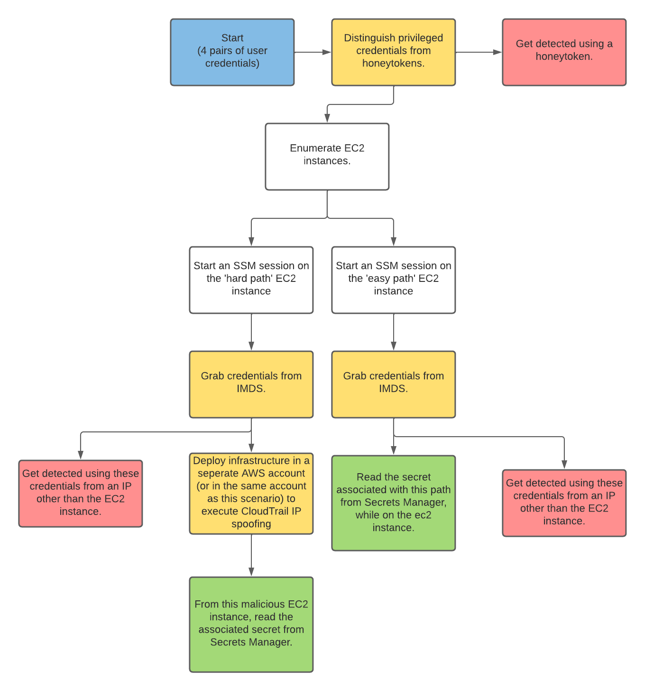

# Scenario: detection_evasion
**Size:**  Medium

**Difficulty:** Hard

**Command:** $ ./cloudgoat.py create detection_evasion

## Scenario Resources (High Level)
4 IAM Users

2 EC2 instances

2 SecretsManager secrets

A suite of detection mechanisms
## Scenario Start(s)
4 pairs of IAM Credentials.
## Scenario Goal(s)
The goal of this scenario is to read out the values for both secrets without being detected. The secrets are both stored in Secrets Manager, and their values have the following format (cg-secret-XXXXXX-XXXXXX).

## Summary (TLDR setup below)
This scenario is significantly different from the CloudGoat scenarios that have come before in how it plays. In detection_evasion, your goals will be outlined for you more clearly, and the challenge is to complete them without triggering alarms. There is more setup involved in this scenario, and it will take longer to play (you might want/need to play it multiple times). 

For starters, you will need to provide an email address to which cloudgoat can send email alerts. When/If you are detected by the automated mechanisms, an alert will be sent to this email address. If you don't want to use your standard email address, you can consider a service such as https://temp-mail.org/ or https://www.fakemail.net/.

After deployment is complete, you will need to wait about an hour before playing the scenario. This is, unfortunately, necessary for the cloudwatch alerts to fully integrate with cloudtrails logs. It should also be kept in mind that there can be a significant delay in alerts for actions that you take (10-15 minutes is not uncommon). So check your email periodically to see if you have triggered an alert. 

## TLDR Setup
1. Set up a temporary email address if desired.
2. Deploy the cloudgoat scenario. You will need to enter your email when prompted, and it will subsequently be stored in the 'config.yml' file at the top level of the repo.
3. Check your email address for SNS confirmation emails; there should be two. Confirm that you want to subscribe to the topics. 
4. Wait 30-60 minutes before working on the scenario. This is necessary because there is some lag between the time that terraform finishes deploying all resources, and the time that your CLI actions will actually trigger the alerts that result in email notifications.
5. Read the 'start.txt' file that is generated after deployment for some guidance. There will not be major spoilers in this file (as there are in [cheat_sheet.md](cheat_sheet.md))

## Exploitation Route

## Walkthrough - Easy Path
1. discover that some of the credentials initially given to you are honeytokens, without triggering alerts.
2. install the aws cli on the instance
3. read the secret value of the corresponding secret from the ec2 instance to avoid detection.

## Walkthrough - Hard Path
1. discover that some of the credentials initially given to you are honeytokens, without triggering alerts.
2. move onto the ec2 instance, and grab the credentials from IMDS
3. spoof the IP of the instance from which you grabbed the credentials, and read the secret value of the corresponding secret.
